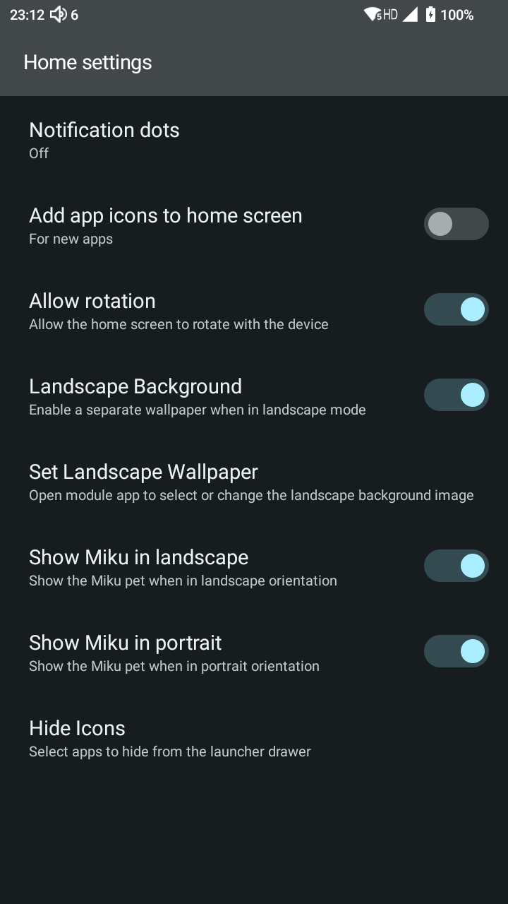
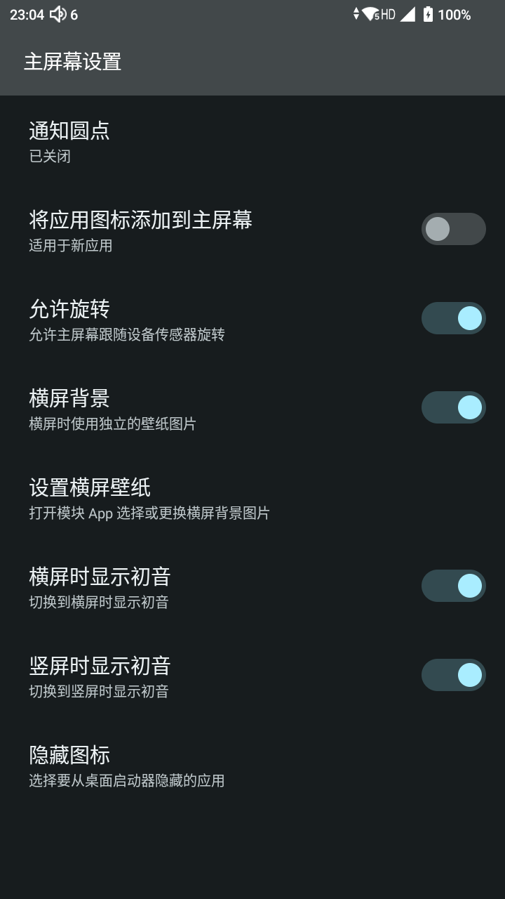
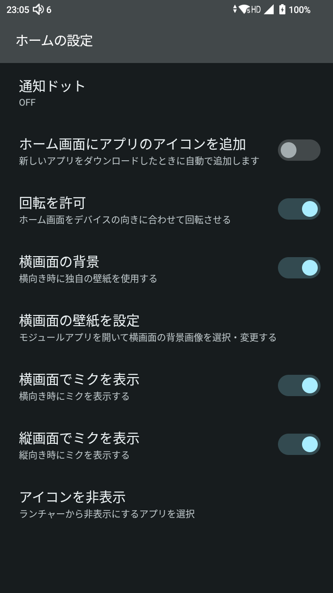

|                  English                   |                     中文                     |                    日本語                     |
|:------------------------------------------:|:------------------------------------------:|:------------------------------------------:|
|  |  |  |

--- 

# MikuMikuHook

A Xposed module for HiBy M500, enhancing the built-in Launcher3 with extra controls.

> Full writeup (Chinese): [soragoto.io/posts/m500](https://soragoto.io/posts/m500/)

## Features

- Hide apps from the launcher drawer
- Toggle home screen rotation
- Control Miku pet visibility by orientation
- Set a dedicated wallpaper for landscape mode
- Adapt Miku drag boundary for landscape mode

## Requirements

- HiBy M500
- Xposed Framework (LSPosed recommended)
- Scope: `com.android.launcher3`

## Build

```bash
./gradlew assembleRelease
```

## License

[MIT](LICENSE)

---

# MikuMikuHook

一个为 HiBy M500 设计的 Xposed 模块，为内置 Launcher3 添加额外功能。

> 折腾过程（中文）：[星海贝M500折腾记录](https://soragoto.io/posts/m500/)

## 功能

- 在启动器中隐藏指定应用
- 开关桌面自动旋转
- 按横竖屏分别控制桌面 Miku 显示
- 为横屏模式单独设置壁纸
- 适配横屏模式下 Miku 拖拽边界

## 环境要求

- HiBy M500
- Xposed 框架（推荐 LSPosed）
- 作用域：`com.android.launcher3`

## 构建

```bash
./gradlew assembleRelease
```

## 许可

[MIT](LICENSE)

---

# MikuMikuHook

HiBy M500 向けの Xposed モジュールです。内蔵 Launcher3 に追加機能を提供します。

> 詳細な記録（中国語）：[soragoto.io/posts/m500](https://soragoto.io/posts/m500/)

## 機能

- ランチャーから指定アプリを非表示
- ホーム画面の自動回転トグル
- 縦画面・横画面それぞれでミク表示を制御
- 横向き時に専用壁紙を設定
- 横画面向けにミクのドラッグ境界を調整

## 動作環境

- HiBy M500
- Xposed フレームワーク（LSPosed 推奨）
- スコープ：`com.android.launcher3`

## ビルド

```bash
./gradlew assembleRelease
```

## ライセンス

[MIT](LICENSE)